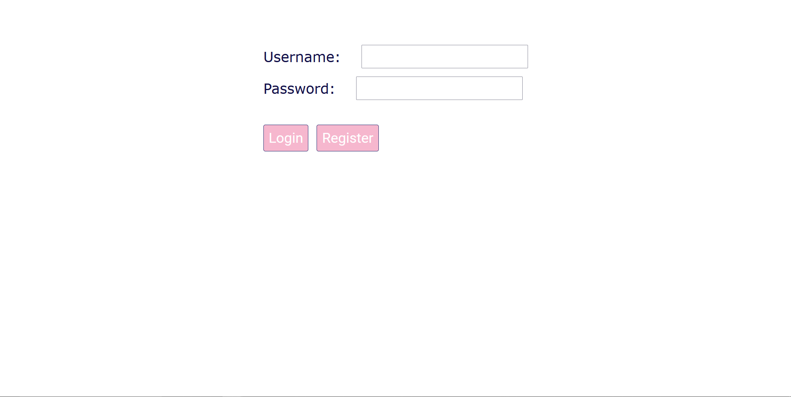
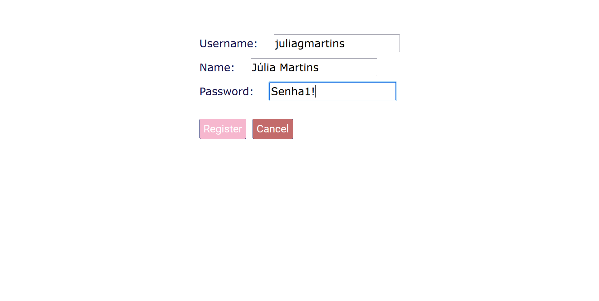
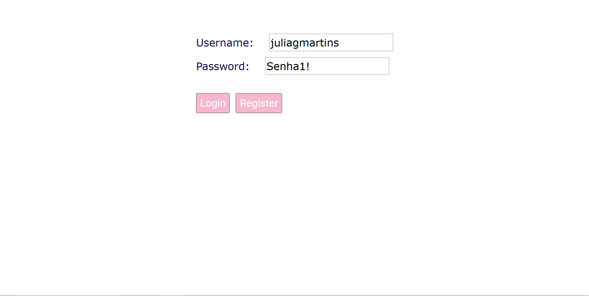
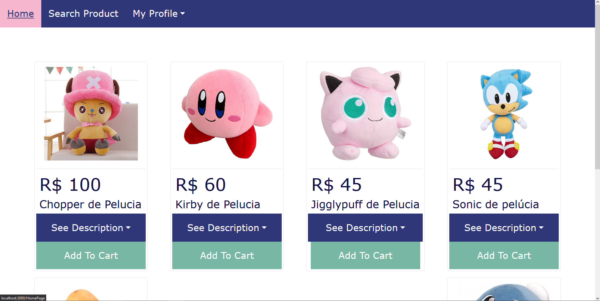
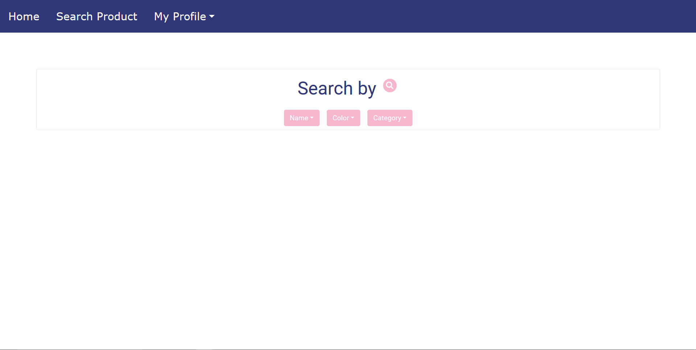
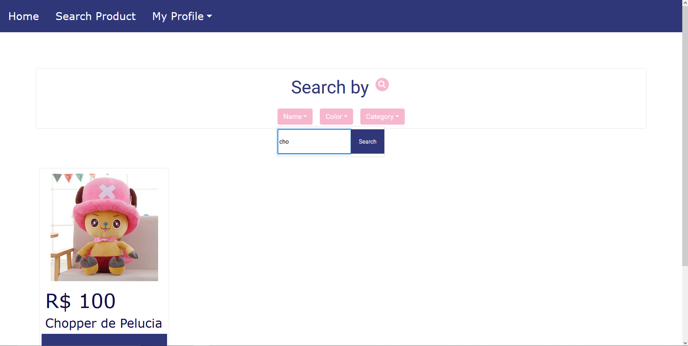
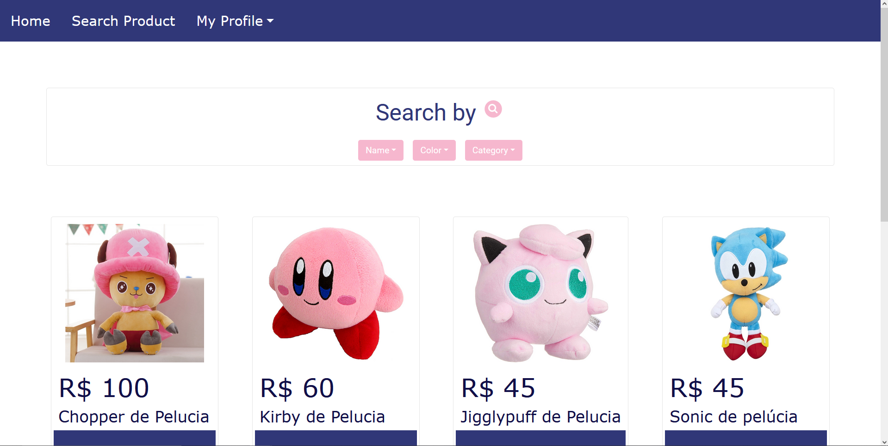
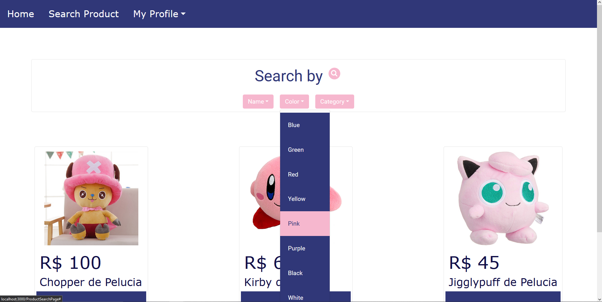
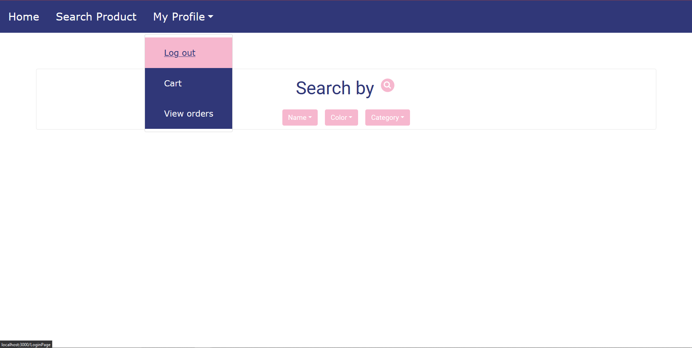

# O Projeto - Ecommerce

O projeto consiste de um serviço de Ecommerce fictício genético. Nesse projeto foram utilizadas diferentes tecnologias e arquiteturas de software, como Domain Driven Design (DDD), MySQL, arquitetura monolítica, dentre outros.

# Arquitetura

## Monolítica

Considerando o tamanho e complexidade da aplicação, que é relativamente pequena, a arquitetura monolítica é uma boa opção para o desenvolvimento backend, devido à simplicidade de implementação, desenvolvimento, teste e facilidade na hora de identificar e corrigir erros. 

# Ferramentas/Frameworks utilizadas

## ASP.NET

Apesar de ASP.NET funcionar bem tanto em microsserviços quanto em arquiteturas monolíticas, seu desempenho em arquiteturas monolíticas se destaca quando comparado ao node.js. Outra vantagem a se considerar é que o ASP.NET apresenta maior segurança, apresentando diversas bibliotecas conhecidas e específicas para acesso a banco de dados e criptografias. Além disso, ASP.NET é a tecnologia utilizada na empresa, ou seja, os desenvolvedores possuem mais experiência e com isso há uma maior garantia de boa implementação.

## React

Assim como o ASP.NET, é a tecnologia já utilizada na empresa, trazendo maior segurança quanto a qualidade da implementação.

# Estrutura do código

## DDD

Visando uma melhor visualização e reaproveitamento de código, a implementação do backend foi pensada de acordo com a abordagem de design de software Domain-Driven Design (DDD). Ou seja, foram utilizados patterns pensando numa construção orientada a domínio. Os padrões e arquitetura foram aplicados de modo simples, a fim de incrementar conforme o projeto for crescendo e necessitando de mais padrões (arquitetura incremental).

## Components pattern

Já no frontend, a estrutura foi simples, pensando na clara divisão em componentes.

# Tecnologias e Bibliotecas

ASP.Net Core Net.6

Swagger UI

Microsoft.AspNetCore.Authentication.JwtBearer

AutoMapper

# Objetivos do projeto

Desenvolver habilidades de desenvolvimento de software implementando uma aplicação.

## Objetivos específicos e seus progressos

- [x] Desenvolvimento de Swagger UI para o “Admin”
- [ ] Desenvolvimento de interface para o “Customer” - Parcialmente desenvolvido
- [ ] Desenvolvimento de interface para o “Admin” 

- [x] Criação de usuário "Admin" e sua autenticação

* Ao "Customer", possibilitar (por meio de uma interface) as funcionalidades de:
* [x] Criar uma conta
* [x] Buscar Produtos
* [x] Visualizar detalhes do produto
* [ ] Adicionar/remover produtos no carrinho - Implementado apenas na API/Swagger
* [ ] Fechar pedido - Implementado apenas na API/Swagger
* [ ] Visualizar pedidos - Implementado apenas na API/Swagger
* [ ] Solicitar cancelamento de pedido - Implementado apenas na API/Swagger

* Ao Admin, possibilitar (por meio de Swagger UI) as funcionalidades de:

- [x] Criar produto
- [x] Editar produto
- [x] Remover produto
- [x] Finalizar pedido
- [x] Cancelar pedido

## Funcionalidades a melhorar/implementar

Algumas funcionalidades não foram implementadas até o atual momento, outras precisam de conserto, ajustes ou melhorias.

Funcionalidades a implementar:

- Busca de produtos avançada, com busca composta...
- Edição de conta de usuário

Melhorias/Implementações backend:

* Melhorar a busca de Cart
* Melhorar a adição e remoção de itens em Cart, iterando a quantidade em CartItem
* Aumentar a segurança no acesso ao usuário e senha, criando IDs únicos, melhorando a anonimidade.
* Adicionar mensagens de erro e descrições
* Adição de interface frontend para administração do site pelo Admin

Melhorias/Implementações frontend:

* Melhorar a separação em mais componentes, principalmente na implementação do Login
* Aumentar a segurança no acesso ao usuário e senha, não há criptografia na comunicação front/API
* Melhorar a visualização dos detalhes dos produtos, criando uma nova janela para o produto selecionado
* Adicionar mensagens de erro e alerta para o usuário, como por exemplo:
  * Avisar que a senha é limitada a 8 caracteres
  * Alertar que o usuário foi registrado
* Adicionar uma página com informações sobre a conta do usuário

# Imagens do frontend atual do projeto

## Página de login

## 

## Página de registro

## Realizando login

## Home

## Página de busca de produtos

## Busca por nome

## Busca por categoria (Pelúcia)

## Busca por cor (Rosa/Pink)

## Opções "My Profile": "Log out", "Cart" e "View order"

